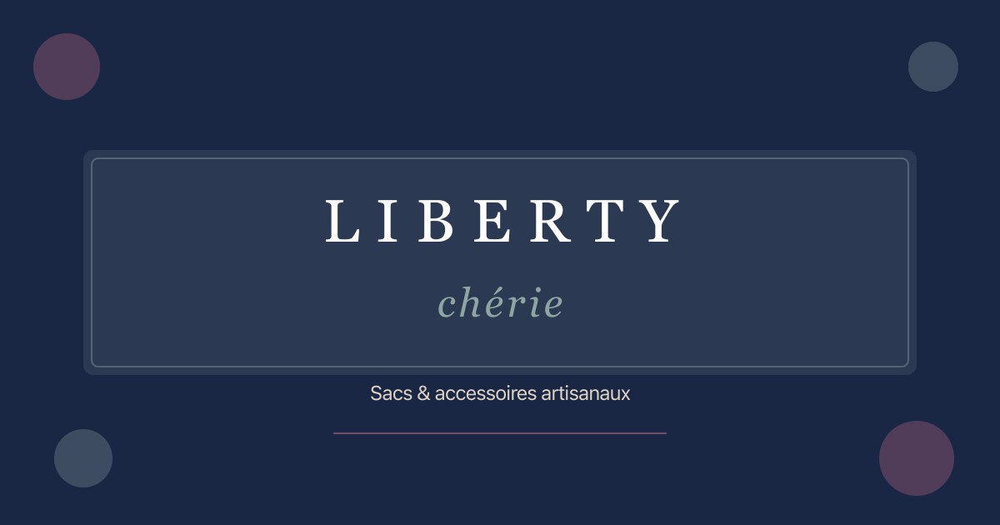

# 🌸 Liberty Chérie Creation

A beautiful e-commerce Progressive Web App (PWA) for Liberty Chérie Creation - a handcrafted bags, pouches, and accessories boutique based in Saint-Sauveur, Quebec.



## ✨ Features

- **E-commerce Store** - Browse and purchase handcrafted products
- **Shopping Cart** - Persistent cart with Zustand state management
- **Square Checkout** - Secure payment processing
- **Custom Orders** - Request custom pieces or jacket transformations
- **PWA Support** - Install as a mobile/desktop app
- **Responsive Design** - Beautiful on all devices
- **SEO Optimized** - Meta tags, Open Graph, and structured data
- **Bilingual Ready** - French translations in database

## 🛠 Tech Stack

- **Framework**: Next.js 16 (App Router)
- **Styling**: Tailwind CSS 4
- **State Management**: Zustand
- **Database**: Supabase (PostgreSQL)
- **Payments**: Square
- **Deployment**: Vercel
- **Icons**: Lucide React

## 📁 Project Structure

```
libertycherie/
├── public/
│   ├── images/           # Product and hero images
│   ├── icons/            # PWA icons
│   └── manifest.json     # PWA manifest
├── src/
│   ├── app/              # Next.js App Router pages
│   │   ├── api/          # API routes (checkout, webhooks)
│   │   ├── checkout/     # Checkout flow
│   │   ├── custom-order/ # Custom order form
│   │   ├── product/      # Product detail pages
│   │   └── products/     # Product catalog
│   ├── components/
│   │   ├── cart/         # Cart drawer
│   │   ├── layout/       # Header, Footer
│   │   └── product/      # ProductCard, ProductGrid
│   ├── lib/              # Utilities (Supabase, Square, products)
│   ├── store/            # Zustand stores
│   └── types/            # TypeScript types
├── scripts/              # Utility scripts
└── supabase/
    └── schema.sql        # Database schema
```

## 🚀 Getting Started

### Prerequisites

- Node.js 18+
- npm or yarn
- Supabase account
- Square developer account

### 1. Clone & Install

```bash
cd libertycherie
npm install
```

### 2. Set Up Supabase

1. Create a new project at [supabase.com](https://supabase.com)
2. Go to SQL Editor and run the contents of `supabase/schema.sql`
3. Copy your project URL and keys from Settings > API

### 3. Set Up Square

1. Create a developer account at [squareup.com/developers](https://squareup.com/developers)
2. Create an application and get your access token, application ID, and location ID
3. Set up a webhook subscription for `payment.completed`

### 4. Configure Environment Variables

Copy the example env file and fill in your values:

```bash
cp .env.local.example .env.local
```

Required variables:
```
NEXT_PUBLIC_SUPABASE_URL=your-project-url
NEXT_PUBLIC_SUPABASE_ANON_KEY=your-anon-key
SUPABASE_SERVICE_ROLE_KEY=your-service-role-key

SQUARE_ACCESS_TOKEN=your-square-access-token
SQUARE_APPLICATION_ID=your-square-application-id
SQUARE_LOCATION_ID=your-square-location-id
SQUARE_ENVIRONMENT=sandbox
SQUARE_WEBHOOK_SIGNATURE_KEY=your-webhook-signature-key

NEXT_PUBLIC_APP_URL=http://localhost:3000
```

### 5. Add Sample Products

```bash
npx ts-node --esm scripts/seed-products.ts
```

### 6. Run Development Server

```bash
npm run dev
```

Open [http://localhost:3000](http://localhost:3000)

## 📦 Deployment to Vercel

### One-Click Deploy

[](https://vercel.com/new/clone?repository-url=https://github.com/yourusername/libertycherie)

### Manual Deploy

1. Push your code to GitHub
2. Connect to Vercel at [vercel.com](https://vercel.com)
3. Add environment variables in Project Settings
4. Deploy!

### Post-Deployment

1. **Update Square Webhook**: Add your production URL
   - Endpoint: `https://yourdomain.com/api/webhooks/square`
   - Events: `payment.completed`

2. **Update NEXT_PUBLIC_APP_URL**: Set to your production domain

3. **Add Product Images**: Upload to Supabase Storage or use external URLs

## 🎨 Customization

### Brand Colors

Edit `src/app/globals.css`:

```css
:root {
  --color-primary: #c26e7a;      /* Dusty Rose */
  --color-secondary: #7a9e7e;    /* Sage Green */
  --color-accent: #d4a574;       /* Warm Gold */
}
```

### Adding Products

Use Supabase dashboard or the admin utilities in `src/lib/admin.ts`:

```typescript
import { addProduct } from '@/lib/admin';

await addProduct({
  name: 'New Product',
  slug: 'new-product',
  description: 'Description here',
  price: 50.00,
  category: 'pouches',
  images: ['/images/products/new-product.jpg'],
});
```

## 🔧 Admin Functions

The `src/lib/admin.ts` file includes utilities for:

- `addProduct()` - Add new products
- `updateProduct()` - Update existing products
- `updateStock()` - Manage inventory
- `getOrders()` - View all orders
- `updateOrderStatus()` - Update order status
- `getCustomOrderRequests()` - View custom order requests
- `getSalesSummary()` - Generate sales reports

## 📱 PWA Features

The app includes:
- Installable on mobile/desktop
- Offline-capable (with proper service worker setup)
- App-like experience
- Push notification ready

To generate PWA icons, use a tool like [RealFaviconGenerator](https://realfavicongenerator.net/).

## 🧪 Development

```bash
# Run development server
npm run dev

# Build for production
npm run build

# Start production server
npm start

# Run linter
npm run lint
```

## 📄 License

This project is private and proprietary to Liberty Chérie Creation.

## 🤝 Support

For questions or issues, contact:
- Email: contact@libertycherie.ca
- Instagram: [@libertycheriecreation](https://instagram.com/libertycheriecreation)

---

Made with 💖 in Saint-Sauveur, Quebec
